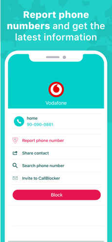

### Important
```
LuckyPal IT started this project from Oct 2016 and first version is launched at Feb 2, 2017.
Under NDA sign, we can't public source and requirement documents, but you can check project under agreement.
```

# Call Blocker: Block spam calls
Identify & Block spam calls
[UnknownPhone.com](https://UnknownPhone.com/)

## iPhone Screenshots
      

Block, identify and report suspicious phone numbers. [UnknownPhone.com](https://UnknownPhone.com/) brings you the most complete app to avoid phone scams, unwanted calls and extra charges in your bill. With more than 100.000 telephone numbers registered and identified in our website and a community with millions of users in the United States and around the world, [UnknownPhone.com](https://UnknownPhone.com/) has the pleasure to bring you its official app.


## BLOCK PHONE NUMBERS

- Do you want to know who is calling you? Are you annoyed by unwanted calls? With our app you will be able to block any phone number you want.


(Activate in your iPhone the call block functionality in Settings -> Phone -> Call Blocking & Identification -> CallBlocker)


## REPORT SUSPICIOUS PHONE NUMBERS

Search any phone number and check if it has been previously reported in [UnknownPhone.com](https://UnknownPhone.com/). Share your experience and warn our community.


## IDENTIFY COMMERCIAL CALLS

Are you receiving calls and have no idea who is calling you? Do they refuse to identify themselves? Check the phone number with our application and find out who calls you. Verify the phone owner and block their calls.


## AVOID THE MOST COMMON SCAMS

- Get the latest and most updated information on telephone scams in the United States. Block suspicious phone numbers before they call you.


## OUR COMMUNITY


[UnknownPhone.com](https://UnknownPhone.com/) is the largest community on phone search and the biggest phone spam directory in the United States. With more than 100.000 identified phone numbers in more than 20 countries.


CallBlocker is [UnknownPhone.com](https://UnknownPhone.com/)’s official phone block app and you will be able to access all of our services from your iPhone.


## Optional subscription to our service


- Unlimited credits. Get information for all numbers you want.

- Automatic detection and block of up to 500 dangerous phone numbers in your country.

- Access without limitations all our records for any phone number.

- No ads.

- Auto-renewing subscription ($1.99 monthly / $4.99 3 months - price varies by country)


CallBlocker respects your right to privacy. Your phonebook will never be public.

Privacy policy: [UnknownPhone.com/privacy-policy](https://UnknownPhone.com/privacy-policy/)

Terms of use: [UnknownPhone.com/terms-of-service](https://UnknownPhone.com/terms-of-service/)


Payment for auto-renewing subscription to CallBlocker will be charged to your iTunes account upon confirmation of purchase. Subscription can be managed and auto-renewal can be turned off by going to the Account Settings on your device. To avoid renewal, you must cancel at least 24 hours before your subscription ends. Your account will be charged for renewal within 24-hours prior to the end of the current period.

## Version History

### 1.2.9 Oct 28, 2019

We keep improving our app in our fight against spam calls, this is what is new in CallBlocker:


• iOS 13 optimized.

• Improved user experience.

• Small bugs fixed.


Enjoy the app!

### 1.2.8 Aug 14, 2019

We keep improving our app in our fight against spam calls, this is what is new in CallBlocker:


• Automatic country/region detection for International Calls.

• Blocking/Unblocking simplified.

• Linked with our website! Now you will be able to block spam phone numbers from [UnknownPhone.com](https://UnknownPhone.com/) just by clicking a button.

• Translated to German, Indonesian and Thai.

• Fixed some minor bugs.


Enjoy the app!

### 1.2.7 Nov 28, 2018
We keep improving our app in our fight against spam calls, this is what is new in CallBlocker:


• Better user experience.

• Faster than ever.

• Fixed some minor bugs.


Enjoy the app! :)

### 1.2.6 Mar 9, 2018
We keep improving our app in our fight against spam calls, this is what is new in CallBlocker:


• We have improved our Call Protection so it can detect more spam calls.

• Adapted to iPhone X.

• Some help screens in case you don't know how to activate Call Blocking in your iPhone.

• We have removed the "1" badge from the app icon.

• Improved user experience

• Fixed bugs


Enjoy the app! :)

### 1.2.5 Oct 15, 2017
- We have corrected some bugs and make the app run faster on iOS 11.

- New phone number search options.

- App is now also available in Italian, Portuguese and Japanese.

### 1.2.4 Jul 4, 2017
We have improved the Call Protection system to update automatically so you can always be protected against the latests dangerous phones found in the United States.

### 1.2.3 Jun 15, 2017
• Minor bugs fixed.

### 1.2.2 Apr 11, 2017
• Premium user in-app purchase activated.

• Minor bugs fixed.

### 1.2.1 Apr 9, 2017
Minor bugs fixed

### 1.2 Mar 21, 2017
- On boarding guide shown when you open the app for the first time.

- New credit system.

- Two types of users: Free and Premium.

- Now you can copy a phone number and block it or search about it when you open the app.

- List with most dangerous phones in your country automatically identified or blocked.

- Help screens to make user experience better.

- Tiny bugs fixed.

### 1.0.1 Feb 24, 2017
Google login fixed

### 1.0 Feb 2, 2017


## License

```
Copyright (c) 2017 LuckyPal IT

Permission is hereby granted, free of charge, to any person obtaining a copy
of this software and associated documentation files (the "Software"), to deal
in the Software without restriction, including without limitation the rights
to use, copy, modify, merge, publish, distribute, sublicense, and/or sell
copies of the Software, and to permit persons to whom the Software is
furnished to do so, subject to the following conditions:

The above copyright notice and this permission notice shall be included in all
copies or substantial portions of the Software.

THE SOFTWARE IS PROVIDED "AS IS", WITHOUT WARRANTY OF ANY KIND, EXPRESS OR
IMPLIED, INCLUDING BUT NOT LIMITED TO THE WARRANTIES OF MERCHANTABILITY,
FITNESS FOR A PARTICULAR PURPOSE AND NONINFRINGEMENT. IN NO EVENT SHALL THE
AUTHORS OR COPYRIGHT HOLDERS BE LIABLE FOR ANY CLAIM, DAMAGES OR OTHER
LIABILITY, WHETHER IN AN ACTION OF CONTRACT, TORT OR OTHERWISE, ARISING FROM,
OUT OF OR IN CONNECTION WITH THE SOFTWARE OR THE USE OR OTHER DEALINGS IN THE
SOFTWARE.
```
